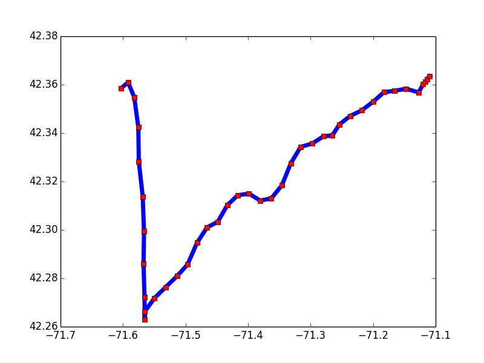

# mplleaflet

mplleaflet is a Python library that converts a [matplotlib](http://matplotlib.org) plot into a webpage
containing a pannable, zoomable [Leaflet](http://leafletjs.com) map. It can also [embed the Leaflet map in an IPython notebook](http://nbviewer.ipython.org/github/jwass/mplleaflet/blob/master/examples/NYC%20Boroughs.ipynb). The goal of mplleaflet is to enable use of Python and matplotlib for visualizing geographic data on [slippy maps](http://wiki.openstreetmap.org/wiki/Slippy_Map) without having to write any Javascript or HTML. You also don't need to worry about the displaying the base map content. Only one line of code is needed to convert a plot into a web map.

The library is heavily inspired by [mpld3](https://github.com/jakevdp/mpld3) and uses  [mplexporter](https://github.com/mpld3/mplexporter) to do most of the heavy lifting to walk through Figure objects.

## Examples
### Basic usage
The simplest use is to just create your plot using matplotlib commands and call `mplleaflet.show()`.

```
>>> import matplotlib.pyplot as plt
... # Load longitude, latitude data
>>> plt.hold(True)
# Plot the data as a blue line with red squares on top
# Just plot longitude vs. latitude
>>> plt.plot(longitude, latitude, 'b') # Draw blue line
>>> plt.plot(longitude, latitude, 'rs') # Draw red squares
```


Normally, displaying data as longitude, latitude will cause a cartographer to cry. That's totally fine with mplleaflet, Leaflet will project your data properly.

```
# Convert to interactive Leaflet map
>>> import mplleaflet
>>> mplleaflet.show()
```

[Click to view final web page](http://htmlpreview.github.io/?https://github.com/jwass/mplleaflet/master/examples/readme_example.html)


Disclaimer: Displaying data in spherical mercator might also cause a cartographer to cry.

`show()` allows you to specify different tile layer URLs, CRS/EPSG codes, output files, etc. 

### IPython Notebook embedding
Just use  `mplleaflet.display()` to embed the interactive Leaflet map in an IPython notebook.
[Click here to see a live example.](http://nbviewer.ipython.org/github/jwass/mplleaflet/blob/master/examples/NYC%20Boroughs.ipynb)

### Other examples
* [basic_plot.py](examples/basic_plot.py): Simple line/point plotting. [View the map](http://htmlpreview.github.io/?https://github.com/jwass/mplleaflet/master/examples/basic_plot.html).
* [quiver.py](examples/quiver.py): Demonstrates use of quiver() to plot 2-D arrows. [View the map](http://htmlpreview.github.io/?https://github.com/jwass/mplleaflet/master/examples/quiver.html).
* [contour.py](examples/contour.py): Compute contour curves. This example demonstrates plotting in a different CRS and letting mplleaflet convert the output. [View the map](http://htmlpreview.github.io/?https://github.com/jwass/mplleaflet/master/examples/contour.html).
* [Embedded IPython notebook example](http://nbviewer.ipython.org/github/jwass/mplleaflet/blob/master/examples/NYC%20Boroughs.ipynb)

## Why mplleaflet?
Other Python libraries, [basemap](http://matplotlib.org/basemap/) and
[folium](https://github.com/wrobstory/folium), exist to create maps in Python. However mplleaflet allows you to leverage  all matplotlib capability without having to set up the background basemap. You can use `plot()` to style points and lines, and you can also use more complex functions like `contour()`, `quiver()`, etc. Furthermore, with mplleaflet you no longer have to worry about setting up the basemap. Displaying continents or roads is determined automatically by the zoom level required to view the physical size of the data. You should use a different library if you need fine control over the basemap, or need a geographic projection other than spherical mercator.

## Dependencies
Required
* [mplexporter](https://github.com/mpld3/mplexporter)
* [jinja2](http://jinja.pocoo.org/)

Optional
* [pyproj](https://code.google.com/p/pyproj/) Only needed if you only use non-WGS-84 projections.
* [GeoPandas](https://github.com/kjordahl/geopandas) To make your life easier.
